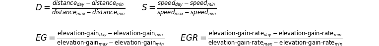
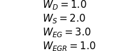

# Biking Performance

Generate simple graphs from data collected using Strava.
See [the graphs](https://psamuels00.github.io/biking/),
<a href="#graph_notes">graph notes</a>,
[input details](https://psamuels00.github.io/biking/inputs/details/last30.html),
[metrics details](https://psamuels00.github.io/biking/metrics/details/daily/last30.html),
and [metrics summary](https://psamuels00.github.io/biking/metrics/summary/daily.html).

The original motivation for this project was the development of a "performance index" to compare the level of effort
of rides that vary in distance, speed, and elevation gain.  Weights such as my body, bike, and gear are not factored
in.  There is no absolute measure, just a comparison with previous rides in order to arrive at a value from 0 to 10.

Then I found some basic physics formulas to estimate power output, work, and total energy expenditure, which is probably
as good as I can get to charting effort without a power meter.  Nevertheless, I decided to keep the performance index
because the graph so far looks rather close to the graph of estimated work performed, and I find that interesting since
the two calculations are so very different.

## Performance Index

The performance index (_pi_) is calculated as a function of

- Distance,
- Speed,
- Elevation Gain, and
- Rate of Elevation Gain

Each component is normalized to the range of values for the component.
For example, if the range for speed is 9 - 15 mph, a value of 12 for a particular day,
right in the middle, is normalized to 0.50.

The normalized values are weighted and summed.

The current weights are as follows.

Finally, all the values are normalized to a scale from 0 to 10.

The formula will, no doubt, require tuning. 
If only distance is available for a day, the Performance Index will not be calculated.

### Analysis

The intuition behind the formula, currently modeled by the Performance Index, is that
- It is harder to increase speed than to increase distance.
- It is harder to increase elevation gain than to increase distance.
- It is harder to gain elevation quickly than over a long period of time.
- It is harder to increase both speed and elevation gain with equal energy than to increase only one.

The following intuitions are _not_ reflected in the current calculation:
- The highest PI value should be achievable from a very high speed alone, even with very low elevation gain.
- The highest PI value should be achievalbe from a very high elevation gain alone, even at very low speed.

The following intuition is _partially_ reflected in the current calculation:
- It is harder to maintain a high speed for a longer distance than for a shorter distance.
  The distance component of PI partially accounts for this, but it is not used as a
  multiplier of speed.  (Perhaps it should be?? ...and perhaps distance should be removed
  as a separate component of the PI calculation.)

#### Problems
The biggest inadequacy of the formula is its failure to model the relationship between elevation gain and speed
whereby the former always works against the latter.  Intuitively, this means "credit" or a score boost for high
elevation gain is easily offset by a low score for speed.  The effect is mitigated by extending a
high-elevation-gain ride with some distance having low elevation gain in order to increase overall speed.

To add one more wrinkle, it is worth noting this mitigation interferes slightly with the purpose for factoring
in the rate of elevation gain.  Ideally, we would know the portion of the ride containing elevation gain and
the speed at various positions along the route.  But for now all we know is the total elevation gain for a ride,
the distance, and the average speed.  The rate of elevation gain is more of a lower-limit than the actual rate.
As more distance is added to the route with little elevation gain, the elevation gain rate appears to go
down.

#### Assumptions
It should be noted the performance index is based on the subjective experience of actual rides.
While I can hope to build a formula that works for others as well, the tuning parameters will still
most likely need to be personalized.

Almost all my rides are circuits, starting and ending at the same place.  This means implicit in the
analysis is the understanding that the total elevation gain is the same as the total elevation loss.
Also, my starting elevation is almost always about 400 feet and goes down quickly in any direction.

#### Future Directions
One approach going forward takes inspiration from calculus.  Instead of analyzing the whole route, the
Strava API can be used to pull all the segments that make a route.  If speed and elevation info are
available per segment, then the same sort of analysis described above can be performed with greater
resolution on the route by applying separately to each segment.  Ultimately, the challenge will still
remain as to how the results of each segment should be combined, whether added, multiplied, or otherwise.

## Power Output

The following formula came from an AI chat.  Seems reasonable to me.

Rolling Resistance Force

    Frr = Cr x W x g

- Cr is the coefficient of rolling resistance (typically around 0.005 for road bikes)
- W is weight of the rider and bike
- g is acceleration due to gravity

Air Reistance Force

    Fd = 1/2 x Cd x A x v^2

- Cd is the coefficient of drag (depends on the rider's position, typically around 0.9 for a cyclist)
- A is the frontal area (typically around 0.5 for a cyclist)
- v is the speed

Gravitational Force (when climbing)

    Fg = W x g x h/d

- h is elevation gain
- d is distance travelled

Total Force

    Ftotal = Frr + Fd + Fg

Power Output

    P = Ftotal x v

The values currently being used are as follows:

    g = 9.806
    C_d = 0.88 - 0.03
    C_r = 0.005 - 0.001
    A = 0.5 - 0.04

Strava reports a value through the app (though not through the API).  I've tried to tune the calculation to match
Strava's estimates using the small adjustments shown above.

## Work Performed

Work is Force times distance, or Power times time:

    W = P x time

## Total Caloric Output

Calories are a measure of energy.  Burning the calories of some food intake does not transfer efficiently to
moving the bike along.  Most of the energy goes off as heat or is used for something else.  About 20-25% of the
calories burned contribute to powering the bike.  For this reason, I show calories as a range.  The average is
based on the center point of the range each day.

## Manual Data Updates

There are two ways to add biking data manually:

1. Use Strava to add an activity, or
2. Add an entry to the data journal, `data/journal.yaml`. For example:

       2024-12-22:
           distance: 2.6
           total_elevation_gain: 566
           start_latlng: [13.45647, -16.57196]
           note: comment is ignored

### Journal fields

The journal file offers more flexibility than adding an activity manually through Strava.
Here's a full list of recognized fields in the Journal.  All are optional:

- average_speed - int or float, speed in mph
- distance - int or float
- elev_high = int or float, elevation high point in feet
- elev_low = int or float, elevation low point in feet
- moving_time = int or float, time in minutes
- note - any comment; ignored
- skipped - reason for skipping the day; ignored
- start_latlng - starting location, will replace any from a Strava activity, used only for starting elevation
- strava_power_estimate - int, power estimate shown in Strava app, in watts
- timeline - significance of date in timeline of project; ignored
- top_speed - int or float, speed in mph
- total_elevation_gain - int or float, elevation gain in feet

## Scripts

To update the graphs based on new activities in Strava:

    src/analyze.py

To update the graphs and push changes to GitHub:

    src/analyze.py && git push

To also publish updates to GitHub Pages:

    ./scripts/publish_updates.sh && git push

Or more simply, to update the graphs and publish them:

    ./scripts/update.sh

## Manual Route Map

This isn't necessary, but I usually create an image of a Google map
showing my route after a ride, and add this to the images directory.
From a Mac, I use Ctrl-Shift-4 to capture a window.  Then I move
this file into the images directory and run the following:

    ./scripts/update.sh <#miles>

for example:

    ./scripts/update.sh 15

## Open Elevation

Strava does not provide the starting elevation, but it provides the starting location as latitude and longitude.
The [Open Elevation](https://www.open-elevation.com/) API is used to determine the elevation from this.

## To Replicate This Project

#### 1. Create a Strava app

If you wish to set up something like this yourself, first follow
[Getting Started with the Strava API](https://developers.strava.com/docs/getting-started/)
to create a Strava app.

#### 2. Get an Initial Access Code

Go to [this URL](http://www.strava.com/oauth/authorize?client_id=999999&response_type=code&redirect_uri=http://localhost/exchange_token&approval_prompt=force&scope=read_all,activity:read).
Replace 999999 with your client_id and submit the form..
Finally, parse the app auth code from the redirect URL:

    http://localhost/exchange_token?state=&code=4c4c4c4c4c4c4c4c4c4c4c4c4c4c4c4c4c4c4c4c&scope=read,read_all

#### 3. Define Strava Access Variables

Define the following environment variables:

    strava_client_id=999999
    strava_client_secret=8f8f8f8f8f8f8f8f8f8f8f8f8f8f8f8f8f8f8f8f
    strava_app_auth_code=4c4c4c4c4c4c4c4c4c4c4c4c4c4c4c4c4c4c4c4c

#### 4. Set up GitHub Pages

Set up GitHub Pages to serve data from the docs/ directory of your project.

#### 5. Clone and install repo

    # clone repo, then...
    pip install -r requirements

#### 6. Set up Journal file

    cp data/journal.template.yaml data/journal.yaml

#### 6. Create SQLite database

    src/mk_database.py

The database is used to cache activity responses from Strava in case suddenly one day
historical data is no longer available from Strava.

## Useful Commands

    . scripts/tryagain.sh
    tryagain

## Graph Notes

The timeline for data collection is:

- Day 1 (Oct 11, 2024) - Start tracking distance manually
- Day 30 (Nov 9, 2024) - Start tracking distance, speed, and elevation using Strava

The green shades on most graphs indicate the day of week, as follows:

On days when someone forgets to use Strava, only distance is available.
