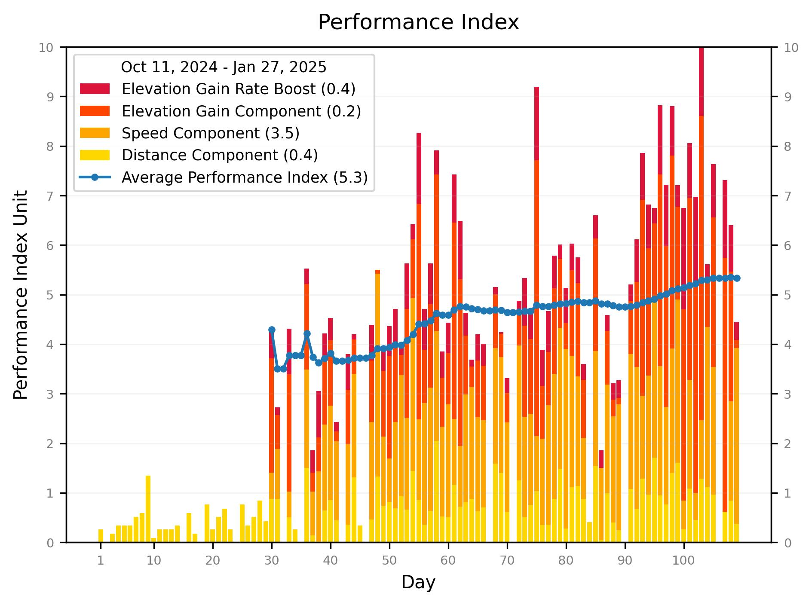
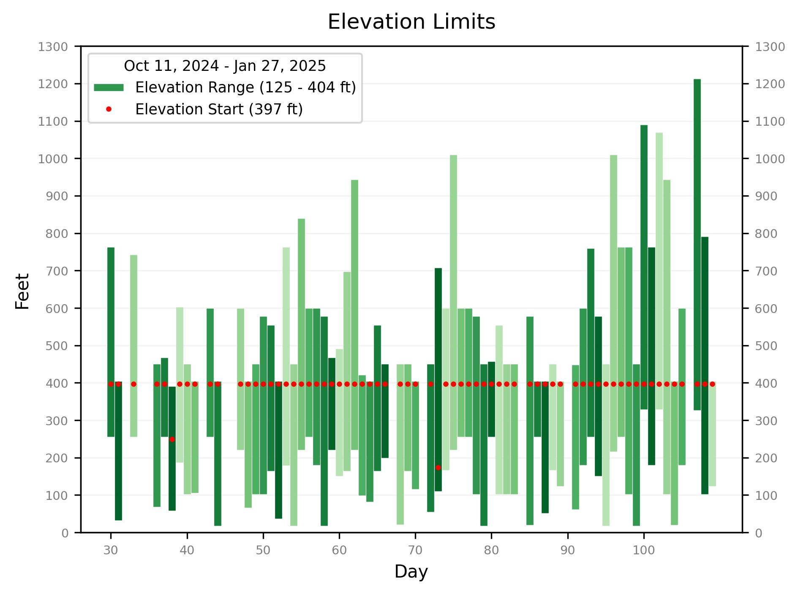
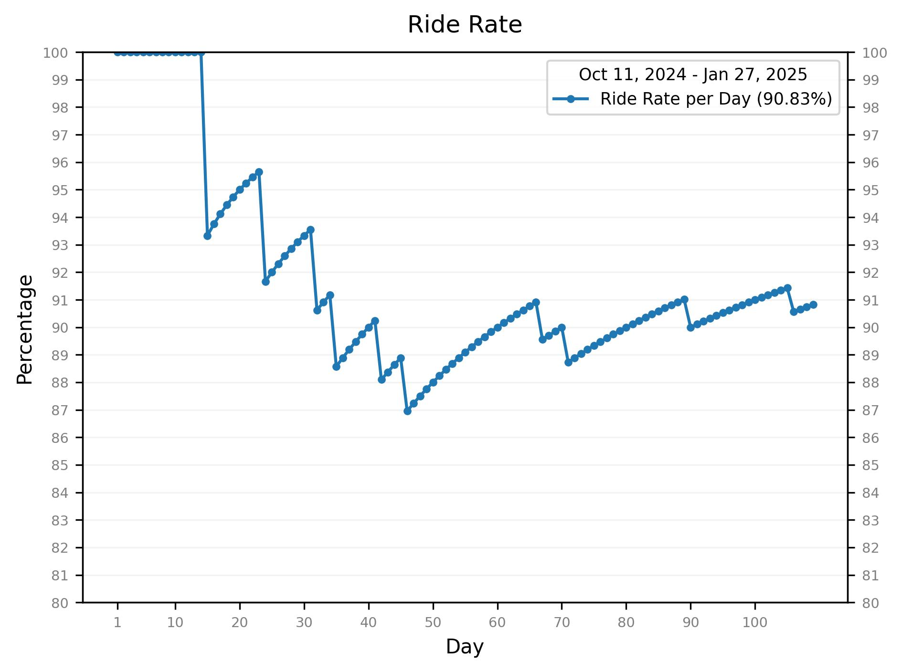

# Biking Performance

Generate simple graphs from data collected using Strava.
See <a href="#graph_notes">Graph Notes</a> and
<a href="https://psamuels00.github.io/biking/">All Graphs</a>.

- <a href="#performance">Performance</a> (see <a href="#performance_calc">Performance Calculation</a>)
- <a href="#speed">Speed</a> &amp; <a href="#top_speed">Top Speed</a>
- <a href="#elev_gain">Elevation Gain</a> &amp; <a href="#elev_limits">Elevation Limits</a>
- <a href="#distance">Distance</a>
- <a href="#ride_rate">Ride Rate</a>

## Graph Notes

The timeline for data collection is:

- Day 1 (Oct 11, 2024) - Start tracking distance manually
- Day 30 (Nov 9, 2024) - Start tracking distance, speed, and elevation using Strava

The green shades on most graphs indicate the day of week, as follows:

On days when someone forgets to use Strava, only distance is available.

## Performance Calculation

The performance index (_pi_) is calculated as a function of

- Distance,
- Speed, and
- Elevation Gain

Each component is normalized to the range of values for the component.
For example, if the range for speed is 9 - 15 mph, a value of 12,
right in the middle, is normalized to 0.50.  The normalized values
are weighted and summed as follows:

In other words, speed contributes twice as much to the _pi_ as distance,
and elevation gain contributes three times as much.  Finally, all the
values are normalized to a scale from 0 to 10.

The formula will, no doubt, require tuning.
If only distance is available for a day, the Performance Index will not be calculated.

## Open Elevation

Strava does not provide the starting elevation, but it provides the starting location as latitude and longitude.
The [Open Elevation](https://www.open-elevation.com/) API is used to determine the elevation from this.

## To Replicate This Project

#### 1. Create a Strava app

If you wish to set up something like this yourself, first follow 
[Getting Started with the Strava API](https://developers.strava.com/docs/getting-started/)
to create a Strava app.

#### 2. Get an Initial Access Code

Go to [this URL](http://www.strava.com/oauth/authorize?client_id=999999&response_type=code&redirect_uri=http://localhost/exchange_token&approval_prompt=force&scope=read_all,activity:read).
Replace 999999 with your client_id and submit the form..
Finally, parse the app auth code from the redirect URL:

    http://localhost/exchange_token?state=&code=4c4c4c4c4c4c4c4c4c4c4c4c4c4c4c4c4c4c4c4c&scope=read,read_all

#### 3. Define Strava Access Variables

Define the following environment variables:

    strava_client_id=999999
    strava_client_secret=8f8f8f8f8f8f8f8f8f8f8f8f8f8f8f8f8f8f8f8f
    strava_app_auth_code=4c4c4c4c4c4c4c4c4c4c4c4c4c4c4c4c4c4c4c4c

## Installation

    # clone repo, then...
    pip install -r requirements
    mkdir data
    touch data/journal.yaml

## Manual Data Updates

There are two ways to add biking data manually:

1. Use Strava to add an activity, or
2. Add an entry to the data journal, `data/journal.yaml`. For example:

       2024-12-22:
           distance: 2.6
           total_elevation_gain: 566
           start_latlng: [13.45647, -16.57196]
           note: comment is ignored

The distance and total_elevation gain are optional, added in addition to any values from Strava.
The start_latlng is also optional and replaces the starting location of any Strava activity for the day.

## Execution

To update the graphs based on new activities in Strava:

    src/analyze.py

To update the graphs and also the output in the README file:

    ./scripts/analyze.sh

To push the changes from either command to GitHub:

    ./scripts/add_bike_ride.sh && git push

Putting it all together, eg:

    ./scripts/analyze.sh && ./scripts/add_bike_ride.sh && git push

## Publish Updates to GitHub Pages

Set up GitHub pages to serve content from /docs.  Then do this:

    ./scripts/publish_updates.sh && git push

## Execute and Publish

To update the graphs and publish updates:

    ./scripts/analyze.sh && ./scripts/add_bike_ride.sh && ./scripts/publish_updates.sh && git push

or more simply:

    ./scripts/update.sh

## New Rides

This isn't necessary, but I usually create an image of a Google map
showing my route after a ride, and add this to the images directory.
From a Mac, I use Ctrl-Shift-4 to capture a window.  Then I move
this file into the images directory and run the following:

    ./scripts/prep_new_ride.sh <#miles>

where <#miles> is the whole number length of the route in miles.
Putting everything together, run something like this:

    ./scripts/prep_new_ride.sh 15 && ./scripts/add_bike_ride.sh && ./scripts/publish_updates.sh && git push

or more simply:

    ./scripts/today.sh 15

## Formulas

Created using https://latexeditor.lagrida.com/ from the files in src/tex.

## Output

In addition to generating the graphs, a summary of metrics is printed
on the console.
Output looks like this:

    Date range: 2024-10-11 to 2025-01-21

    days  total  biked  tracked  skipped  ride rate
          -----  -----  -------  -------  ---------
            103     94     64        9     91.26%

    distance (miles)  min   max   avg   total
                      ----  ----  ----  -------
                       6.9  31.4  15.4   1450.9

    speed (mph)  min   max   avg
                 ----  ----  ----
                  9.1  14.5  11.4

    top speed (mph)  min   max   avg
                     ----  ----  ----
                     22.9  42.9  30.7

    elevation gain (ft)  min   max   avg   total    total miles
                         ----  ----  ----  -------  -----------
                          287  2212   846    54168         10.3

    elevation range (ft)  low:  min   max   avg   high:  min   max   avg
                                ----  ----  ----         ----  ----  ----
                                 17   329   146           390  1088   578
