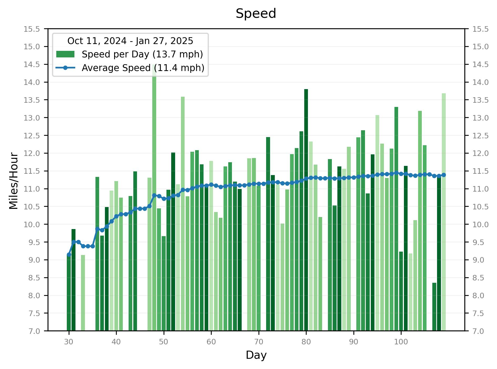

# Biking Performance

Generate graphs such as the following from data collected using Strava.
See <a href="#notes">Graph Notes</a> 
and <a href="#performance_index">Performance Index</a>
below for an explanation.

## Graph Notes

The timeline for data analysis is:

- Day 1 (Oct 11, 2024) - Start tracking distance manually
- Day 30 (Nov 9, 2024) - Start tracking distance, speed, and elevation using Strava
- Day 43 (Nov 22, 2024) - Start to access Strava data via API and generate graphs
- Day 93 (Jan 11, 2025) - Start calculating Performance Index

On days when someone forgets to use Strava, only distance is available.

The green shades on most graphs indicate the day of week, as follows:

## Performance Index

The performance index is calculated as a function of

- Distance,
- Speed, and
- Elevation Gain

Each component is normalized to the range of values for the component.
For example, if the range for speed is 9 - 15 mph, a value of 12,
right in the middle, is normalized to 0.50.  The normalized values
are weighted and summed as follows:

    normalized_distance + normalized_speed * 2.0 + normalized_elevation * 3.0

In other words, speed contributes twice as much to the PI as distance,
and elevation gain contributes three times as much.  Finally, all the
values are normalized to a scale from 0 to 10.

The formula will, no doubt, require tuning.
If only Distance is available for a day, the Performance Index will not be calculated.

## Open Elevation

Strava does not provide the starting elevation, but it provides the starting location as latitude and longitude.
The Open Elevation API is used to determine the elevation from this.

## To Replicate This Project

#### 1. Create a Strava app

If you wish to set up something like this yourself, first follow 
[Getting Started with the Strava API](https://developers.strava.com/docs/getting-started/)
to create a Strava app.

#### 2. Get an Initial Access Code

Go to [this URL](http://www.strava.com/oauth/authorize?client_id=999999&response_type=code&redirect_uri=http://localhost/exchange_token&approval_prompt=force&scope=read_all,activity:read).
Replace 999999 with your client_id and submit the form..
Finally, parse the app auth code from the redirect URL:

    http://localhost/exchange_token?state=&code=4c4c4c4c4c4c4c4c4c4c4c4c4c4c4c4c4c4c4c4c&scope=read,read_all

#### 3. Define Strava Access Variables

Define the following environment variables:

    strava_client_id=999999
    strava_client_secret=8f8f8f8f8f8f8f8f8f8f8f8f8f8f8f8f8f8f8f8f
    strava_app_auth_code=4c4c4c4c4c4c4c4c4c4c4c4c4c4c4c4c4c4c4c4c

## Installation

    pip install -r requirements

## Execution

To update the graphs based on new activities in Strava:

    src/analyze.py

To update the graphs and also the output in the README file:

    ./scripts/analyze.sh

## Update Github

To update graphs and upload the changes to Github:

    ./scripts/add_new_route.sh

## Manual Data Updates

There are two ways to add biking data manually:
1. Use Strava to add an activity, or
2. Add an entry to the InputData.manual_data dict in src/biking/input.py.

## New Rides

This isn't necessary, but I usually create an image of a Google map
showing my route after a ride, and add this to the images directory.
From a Mac, I use Ctrl-Shift-4 to capture a window.  Then I move
this file into the images directory and run the following:

    ./scripts/prep_new_route.sh <#miles>
    ./scripts/add_new_route.sh

where <#miles> is the whole number length of the route in miles.
eg:

    ./scripts/prep_new_route.sh 15 && ./scripts/add_new_route.sh

## Output

In addition to generating the graphs, a summary of metrics is printed
on the console.
Output looks like this:

    Date range: 2024-10-11 to 2025-01-14

    days  total  biked  tracked  skipped  ride rate
          -----  -----  -------  -------  ---------
             96     87     57        9     90.62%

    distance (miles)  min   max   avg   total
                      ----  ----  ----  -------
                       6.9  31.4  15.2   1320.5

    speed (mph)  min   max   avg
                 ----  ----  ----
                  9.1  14.5  11.4

    top speed (mph)  min   max   avg
                     ----  ----  ----
                     22.9  42.9  30.2

    elevation gain (ft)  min   max   avg   total    total miles
                         ----  ----  ----  -------  -----------
                          287  2031   767    43722          8.3

    elevation range (ft)  low:  min   max   avg   high:  min   max   avg
                                ----  ----  ----         ----  ----  ----
                                 17   256   140           390  1009   547
