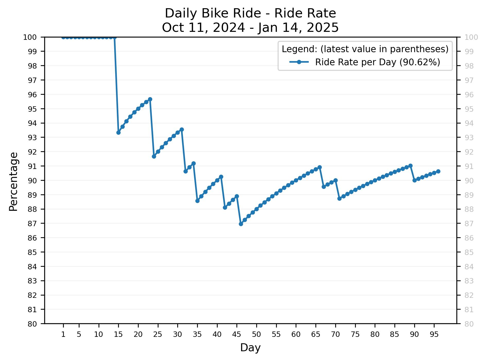
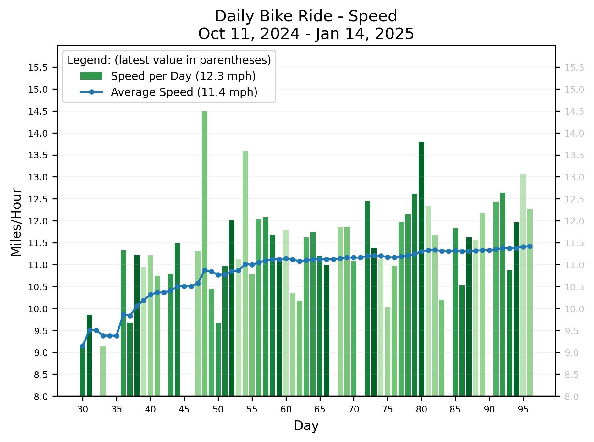
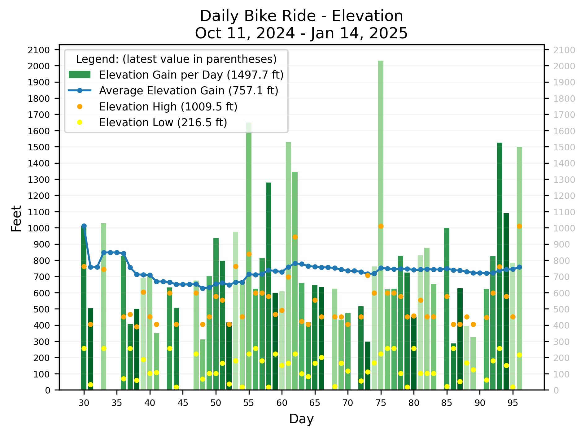

# Biking Statistics

Generate graphs such as the following from data collected using Strava.

There is also a way to augment the Strava data.  See <a href="#input">Input</a> below.

## Create a Strava app

Follow [Getting Started with the Strava API](https://developers.strava.com/docs/getting-started/)
to create a Strava app.

### Get an Initial Access Code:

Go to [this URL](http://www.strava.com/oauth/authorize?client_id=999999&response_type=code&redirect_uri=http://localhost/exchange_token&approval_prompt=force&scope=read_all,activity:read).
Replace 999999 with your client_id and submit the form..
Finally, parse the app auth code from the redirect URL:

    http://localhost/exchange_token?state=&code=4c4c4c4c4c4c4c4c4c4c4c4c4c4c4c4c4c4c4c4c&scope=read,read_all

### Define Strava Access Variables

Define the following environment variables:

    strava_client_id=999999
    strava_client_secret=8f8f8f8f8f8f8f8f8f8f8f8f8f8f8f8f8f8f8f8f
    strava_app_auth_code=4c4c4c4c4c4c4c4c4c4c4c4c4c4c4c4c4c4c4c4c

## Installation

    pip install -r requirements

## Execution

    src/analyze.py

To update the data after a ride:

    ./scripts/prep_new_route.sh <#miles>
    ./scripts/add_new_route.sh

eg:

    ./scripts/prep_new_route.sh 15 && ./scripts/add_new_route.sh

## Input

*TODO*

## Output

Output looks similar to this:

    Date range: 2024-10-11 to 2024-12-29

    total days  biked  skipped  ride rate
    ----------  -----  -------  ---------
            80     72        8     90.00%

    biked miles  min   max   avg   avg-per-day-biked
    -----------  ----  ----  ----  -----------------
         1053.6   6.9  31.4  13.2               14.6

    Daily Distance per Day saved to output/DailyDistance.jpg.

An example of the generated graph is shown above.
