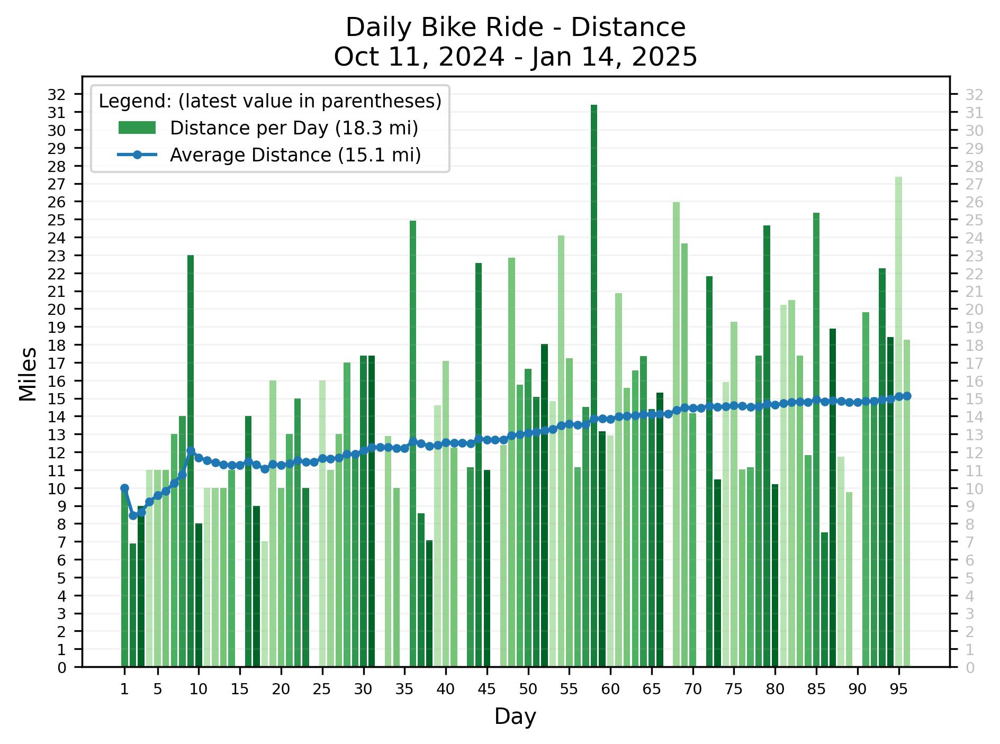
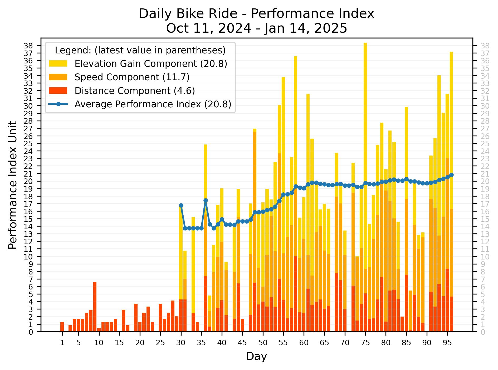

# Biking Statistics

Generate graphs such as the following from data collected using Strava.

There is also a way to augment the Strava data.  See <a href="#input">Input</a> below.

## Create a Strava app

Follow [Getting Started with the Strava API](https://developers.strava.com/docs/getting-started/)
to create a Strava app.

### Get an Initial Access Code:

Go to [this URL](http://www.strava.com/oauth/authorize?client_id=999999&response_type=code&redirect_uri=http://localhost/exchange_token&approval_prompt=force&scope=read_all,activity:read).
Replace 999999 with your client_id and submit the form..
Finally, parse the app auth code from the redirect URL:

    http://localhost/exchange_token?state=&code=4c4c4c4c4c4c4c4c4c4c4c4c4c4c4c4c4c4c4c4c&scope=read,read_all

### Define Strava Access Variables

Define the following environment variables:

    strava_client_id=999999
    strava_client_secret=8f8f8f8f8f8f8f8f8f8f8f8f8f8f8f8f8f8f8f8f
    strava_app_auth_code=4c4c4c4c4c4c4c4c4c4c4c4c4c4c4c4c4c4c4c4c

## Installation

    pip install -r requirements

## Execution

    src/analyze.py

To update the data after a ride:

    ./scripts/prep_new_route.sh <#miles>
    ./scripts/add_new_route.sh

eg:

    ./scripts/prep_new_route.sh 15 && ./scripts/add_new_route.sh

## Input

*TODO*

## Output

Output looks like this:

    Date range: 2024-10-11 to 2025-01-11

    days  total  biked  skipped  ride rate
          -----  -----  -------  ---------
             93     84        9     90.32%

    distance (miles)  min   max   avg   avg-per-day-biked  total
                      ----  ----  ----  -----------------  -------
                       6.9  31.4  13.5               14.9   1253.9

    elevation gain (ft)  min   max   total    total miles
                         ----  ----  -------  -----------
                           11  2031    39483          7.5

    elevation range (ft)  low:  min   max   high:  min   max
                                ----  ----         ----  ----
                                 17   256           390  1009

    speed (mph)  avg:  min   max   max:  min   max
                       ----  ----        ----  ----
                        9.1  14.5        22.9  38.7
